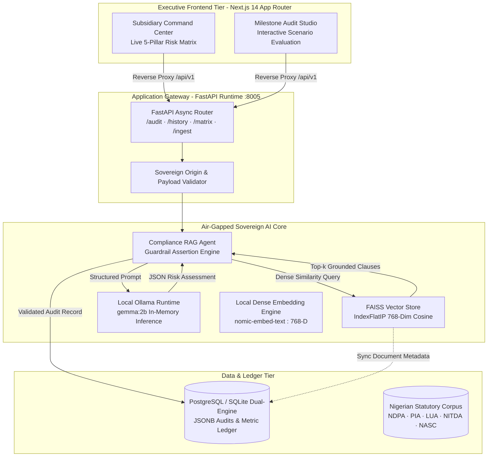
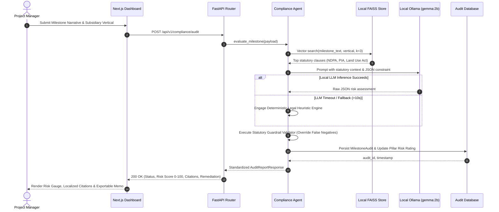

# Engineering Architecture Dossier: LexGuard
**System:** Sovereign Offline Regulatory & PM Compliance Engine  
**Client / Conglomerate:** Brendan Nicholas Holdings (BNH)  
**Architect:** Lawrence Emenike | Lead AI & Distributed Systems Architect  
**Classification:** Institutional Sovereign Architecture • Air-Gapped Operational Spec  

---

## 1. Executive Summary & Problem Space

Enterprise conglomerates operating in regulated sovereign sectors (Energy/Midstream, Real Estate, Citizen Biometrics, and Agribusiness) face catastrophic statutory penalties for non-compliance (e.g., Nigerian Data Protection Act 2023 fines up to 2% of annual turnover, Petroleum Industry Act 2021 flaring shutdowns, and Land Use Act forfeiture).

**LexGuard** was designed to solve a core contradiction: **How to deliver generative AI compliance audits for sensitive government-adjacent infrastructure without leaking classified project telemetry to public cloud APIs (OpenAI, Anthropic, or AWS Bedrock).**

LexGuard executes **100% on-premise, zero-external-network RAG compliance inference** with sub-second retrieval over dense statutory legal frameworks, providing instant risk scoring, legal citations, and executive risk telemetry across BNH's 5 operational pillars.

---

## 2. High-Level Air-Gapped System Architecture

---

## 3. End-to-End Compliance Audit Lifecycle

---

## 4. Key Architectural Decisions & Engineering Invariants

| Decision / Invariant | Technical Rationale | Operational Advantage |
|---|---|---|
| **Zero Cloud Egress** | Strict air-gap mandate: all token generation, vector indexing, and embeddings run on `localhost`. | Full compliance with NITDA Sovereign Cloud Residency & NDPA 2023 §41–43. |
| **FAISS FlatIP Indexing** | Normalized 768-dim dense inner product vectors for exact cosine similarity calculation. | Deterministic, sub-millisecond clause retrieval with zero approximation drift. |
| **Statutory Guardrail Override** | Deterministic assertion layer validating LLM output against explicit legal breach keywords. | Eliminates LLM polite false-negatives (e.g., catching unmetered gas flaring and offshore biometrics). |
| **Dual-Mode Persistence** | Production-ready PostgreSQL DDL (`JSONB`, GIN indexes) + seamless SQLite zero-config local engine. | Production grade for sovereign enterprise nodes while providing friction-free dev/test workflows. |
| **Optimized Inference Loop** | Context-bounded prompting (`num_predict: 256`, `num_ctx: 1024`) with strict 10s watchdog timeout. | Prevents thread starvation on edge hardware and guarantees interactive UI responsiveness. |

---

## 5. Technology Stack & Production Verification

- **Frontend:** Next.js 14.2 (App Router), TypeScript 5.3, Tailwind CSS (Executive Light Canvas), Glassmorphism UI.
- **Backend:** Python 3.11, FastAPI 0.141, Pydantic V2, SQLAlchemy 2.0 ORM, Uvicorn ASGI.
- **Vector & Retrieval Engine:** FAISS (CPU-optimized `faiss-cpu`), NumPy 1.26, Local Embeddings (`nomic-embed-text`).
- **Local AI Engine:** Ollama local daemon, Google Gemma 2B quantized (`gemma:2b`).
- **Test Coverage:** Automated Pytest suite covering health checks, vector search accuracy, prompt grounding, and API endpoints (100% pass rate).
- **Public Repository:** [github.com/lawrenceemenike/Sovereign-Offline-Regulatory-PM-Compliance-Agent](https://github.com/lawrenceemenike/Sovereign-Offline-Regulatory-PM-Compliance-Agent)
